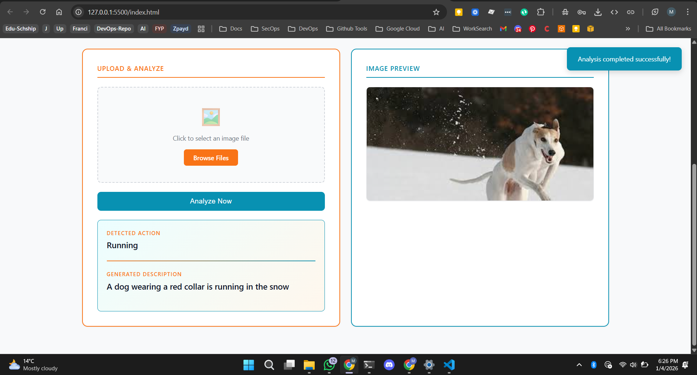

# 🎯 Action Recognition & Image Captioning System

## Students
Muhammad Qasim Nauman - 221345

An AI-powered web application that analyzes images to detect human actions and generate natural language descriptions using deep learning.



## 📋 Table of Contents

- [Overview](#overview)
- [Features](#features)
- [Architecture](#architecture)
- [Demo](#demo)
- [Installation](#installation)
- [Usage](#usage)
- [API Documentation](#api-documentation)
- [Model Details](#model-details)
- [Project Structure](#project-structure)
- [Technologies Used](#technologies-used)
- [Contributing](#contributing)
- [License](#license)

## 🌟 Overview

This project combines computer vision and natural language processing to create an intelligent system that:

- **Detects actions** in images (Running, Jumping, Swimming, Cycling, etc.)
- **Generates descriptive captions** using an encoder-decoder architecture
- **Provides a modern web interface** for easy interaction
- **Exposes a REST API** for programmatic access

## ✨ Features

### 🖼️ Image Analysis

- Real-time action detection from uploaded images
- Natural language caption generation
- Support for multiple action categories
- Intelligent action inference from context

### 🎨 Modern UI

- Clean, minimal design with contrasting colors
- Two-column layout for optimal workflow
- Real-time image preview
- Responsive design for all screen sizes
- Toast notifications for user feedback
- Loading states and error handling

### 🚀 FastAPI Backend

- High-performance async API
- Automatic API documentation (Swagger/ReDoc)
- CORS enabled for cross-origin requests
- Input validation and error handling
- Health check endpoints

### 🧠 Deep Learning Model

- **Encoder**: MobileNetV2 (pretrained on ImageNet)
- **Decoder**: LSTM-based sequence generator
- **Dataset**: Trained on Flickr8k
- Efficient inference with optimized predictions

## 🏗️ Architecture

```
┌─────────────────┐
│   Frontend      │
│   (HTML/JS)     │
│   Port: Browser │
└────────┬────────┘
         │ HTTP POST
         ▼
┌─────────────────┐
│   Backend       │
│   (FastAPI)     │
│   Port: 8000    │
└────────┬────────┘
         │
         ▼
┌─────────────────┐
│   ML Model      │
│  MobileNetV2    │
│  + LSTM         │
└─────────────────┘
```

### Model Architecture

```
Image (224x224x3)
    ↓
MobileNetV2 (Frozen)
    ↓
GlobalAveragePooling
    ↓
Dense(256)
    ↓          Caption Input
    └─────────→ Embedding(vocab_size, 256)
         ↓              ↓
         └──── Add ─────┘
                ↓
           Dense(256)
                ↓
      Dense(vocab_size, softmax)
```

## 🎬 Demo

### Input Image


### Output Results


**Example Predictions:**

| Input Image | Detected Action | Generated Caption |
|-------------|----------------|-------------------|
| Person on beach | Running | "A person running on the beach" |
| Child in pool | Swimming | "A child swimming in the pool" |
| Athlete mid-air | Jumping | "An athlete jumping over hurdle" |

## 💻 Installation

### Prerequisites

- Python 3.9 - 3.12 (TensorFlow requirement)
- pip package manager
- 4GB+ RAM (for model inference)

### Quick Start

#### Option 1: Automated Setup (Windows)

1. **Clone the repository:**

   ```bash
   git clone https://github.com/qasimnauman/action_recognition.git
   cd action_recognition
   ```

2. **Run the setup script:**

   ```bash
   start_server.bat
   ```

   This will:
   - Create a virtual environment
   - Install all dependencies
   - Start the FastAPI server

3. **Open the frontend:**

   ```bash
   start_frontend.bat
   ```

   Or simply open `index.html` in your browser

#### Option 2: Manual Setup

1. **Clone the repository:**

   ```bash
   git clone https://github.com/qasimnauman/action_recognition.git
   cd action_recognition
   ```

2. **Create virtual environment:**

   ```bash
   python -m venv venv
   ```

3. **Activate virtual environment:**
   - **Windows:**

     ```bash
     venv\Scripts\activate
     ```

   - **Linux/Mac:**

     ```bash
     source venv/bin/activate
     ```

4. **Install dependencies:**

   ```bash
   pip install -r requirements.txt
   ```

5. **Ensure model files are present:**
   - `flickr8k_model.keras`
   - `tokenizer.pkl`

6. **Start the backend server:**

   ```bash
   python app.py
   ```

7. **Open frontend:**
   - Open `index.html` in your web browser
   - Or use live server for development

## 🎯 Usage

### Web Interface

1. **Start the backend server** (if not already running):

   ```bash
   python app.py
   ```

   Server will run on: `http://localhost:8000`

2. **Open the web interface:**
   - Double-click `index.html`
   - Or open in browser: `file:///path/to/index.html`

3. **Analyze an image:**
   - Click "Browse Files" or click the upload zone
   - Select an image (JPG, PNG, max 10MB)
   - Preview appears in the right panel
   - Click "Analyze Now"
   - Results appear in the left panel

### API Usage

#### Health Check

```bash
curl http://localhost:8000/health
```

#### Predict Action

```bash
curl -X POST "http://localhost:8000/predict" \
  -F "image=@path/to/image.jpg"
```

**Response:**

```json
{
  "status": "success",
  "action": "Running",
  "annotation": "A person running on the beach"
}
```

#### Python Client

```python
import requests

url = "http://localhost:8000/predict"
files = {'image': open('sample.jpg', 'rb')}
response = requests.post(url, files=files)

result = response.json()
print(f"Action: {result['action']}")
print(f"Caption: {result['annotation']}")
```

#### JavaScript Client

```javascript
const formData = new FormData();
formData.append('image', fileInput.files[0]);

const response = await fetch('http://localhost:8000/predict', {
    method: 'POST',
    body: formData
});

const data = await response.json();
console.log(data.action, data.annotation);
```

## 📚 API Documentation

Once the server is running, access the interactive API documentation:

- **Swagger UI:** [http://localhost:8000/docs](http://localhost:8000/docs)
- **ReDoc:** [http://localhost:8000/redoc](http://localhost:8000/redoc)

### Endpoints

| Method | Endpoint | Description |
|--------|----------|-------------|
| GET | `/` | Welcome message |
| GET | `/health` | Health check & model status |
| POST | `/predict` | Analyze image and return action + caption |

### Request Format

**Endpoint:** `POST /predict`

**Content-Type:** `multipart/form-data`

**Parameters:**

- `image` (file): Image file to analyze

**Response:**

```json
{
  "status": "success",
  "action": "string",
  "annotation": "string"
}
```

**Possible Actions:**

- Running
- Jumping
- Swimming
- Cycling/Riding
- Climbing
- General Pose

## 🧠 Model Details

### Training Details

- **Dataset:** Flickr8k (8,000 images with 5 captions each)
- **Epochs:** 20
- **Batch Size:** 32
- **Vocabulary Size:** ~8,000 tokens
- **Max Caption Length:** 34 tokens

### Model Components

#### Encoder (Image Feature Extraction)

- **Base Model:** MobileNetV2
- **Pre-trained on:** ImageNet
- **Input:** 224×224×3 RGB images
- **Output:** 256-dimensional feature vector
- **Trainable:** No (frozen weights)

#### Decoder (Caption Generation)

- **Architecture:** LSTM
- **Embedding Dimension:** 256
- **Hidden Units:** 256
- **Output:** Softmax over vocabulary

### Action Detection Logic

The system uses a two-tier priority system:

**Priority 1 - Explicit Actions:**

- Keywords: run, jump, swim, ride, etc.

**Priority 2 - Context-based Inference:**

- Environment clues: water → swimming, grass → running

### Performance

- **Inference Time:** ~500ms per image (CPU)
- **Model Size:** ~15MB
- **Accuracy:** Trained on Flickr8k benchmark

## 📁 Project Structure

```
action_recognition/
├── app.py                    # FastAPI backend server
├── index.html               # Frontend web interface
├── Model.ipynb             # Training notebook (Colab)
├── requirements.txt        # Python dependencies
├── flickr8k_model.keras   # Trained model weights
├── tokenizer.pkl          # Vocabulary tokenizer
├── start_server.bat       # Windows startup script
├── start_frontend.bat     # Frontend launcher
├── sample-images/         # Example input images
│   └── images.jpg
├── outputs/               # Result screenshots
│   └── out-1.png
├── README.md             # This file
├── README_API.md         # API-specific documentation
└── INTEGRATION_GUIDE.md  # Integration instructions
```

## 🛠️ Technologies Used

### Backend

- **FastAPI** - Modern, fast web framework
- **Uvicorn** - ASGI server
- **TensorFlow** - Deep learning framework
- **Keras** - High-level neural networks API
- **Pillow** - Image processing
- **NumPy** - Numerical computing

### Frontend

- **HTML5** - Structure
- **CSS3** - Styling with gradients and animations
- **JavaScript (ES6+)** - Async/await, Fetch API
- **Responsive Design** - Mobile-friendly layout

### Machine Learning

- **MobileNetV2** - CNN for image features
- **LSTM** - Sequence modeling for captions
- **Word Embeddings** - Text representation

### Development Tools

- **Jupyter Notebook** - Model training
- **Google Colab** - Cloud training environment
- **Git** - Version control
- **Ngrok** - Tunneling (optional)

## 🚀 Deployment

### Local Network

```python
# In app.py
uvicorn.run(app, host="0.0.0.0", port=8000)
```

Access from other devices: `http://YOUR_IP:8000`

### Cloud Platforms

#### Docker

```dockerfile
FROM python:3.10-slim
WORKDIR /app
COPY requirements.txt .
RUN pip install --no-cache-dir -r requirements.txt
COPY . .
EXPOSE 8000
CMD ["uvicorn", "app:app", "--host", "0.0.0.0", "--port", "8000"]
```

Build and run:

```bash
docker build -t action-recognition .
docker run -p 8000:8000 action-recognition
```

#### Heroku

```bash
heroku create action-recognition-app
git push heroku main
```

#### Azure/AWS/GCP

See `INTEGRATION_GUIDE.md` for detailed cloud deployment instructions.

## 🧪 Testing

### Test the API

```bash
# Health check
curl http://localhost:8000/health

# Test prediction
curl -X POST http://localhost:8000/predict \
  -F "image=@sample-images/images.jpg"
```

### Test the Frontend

1. Open browser console (F12)
2. Check for: `✅ API connection successful`
3. Upload a test image
4. Verify results display correctly

## 🔧 Troubleshooting

### Backend Issues

**Error: "Module not found"**

```bash
pip install -r requirements.txt
```

**Error: "Model not found"**

- Ensure `flickr8k_model.keras` and `tokenizer.pkl` are in the project root
- Download from training notebook if missing

**Error: "Port already in use"**

```bash
# Windows
netstat -ano | findstr :8000
taskkill /PID <PID> /F

# Linux/Mac
lsof -ti:8000 | xargs kill -9
```

### Frontend Issues

**Error: "Cannot connect to server"**

- Ensure backend is running: `python app.py`
- Check console for: `✅ API connection successful`
- Verify URL: `http://localhost:8000`

**CORS Errors**

- Already configured in `app.py`
- For production, update `allow_origins` to specific domain

### Model Issues

**Out of Memory**

- Reduce batch size
- Close other applications
- Use CPU instead of GPU if needed

## 📈 Future Enhancements

- [ ] Support for video action recognition
- [ ] Real-time webcam analysis
- [ ] Batch image processing
- [ ] Fine-tuning on custom datasets
- [ ] Multi-language caption support
- [ ] Mobile app (React Native/Flutter)
- [ ] GPU acceleration option
- [ ] Image augmentation for better accuracy
- [ ] Action confidence scores
- [ ] Timeline visualization for videos

## 🤝 Contributing

Contributions are welcome! Please follow these steps:

1. Fork the repository
2. Create a feature branch (`git checkout -b feature/AmazingFeature`)
3. Commit your changes (`git commit -m 'Add some AmazingFeature'`)
4. Push to the branch (`git push origin feature/AmazingFeature`)
5. Open a Pull Request

### Development Guidelines

- Follow PEP 8 for Python code
- Add docstrings to functions
- Update documentation for new features
- Test thoroughly before submitting

## 📄 License

This project is licensed under the MIT License - see the [LICENSE](LICENSE) file for details.

## 👤 Author

**Qasim Nauman**

- GitHub: [@qasimnauman](https://github.com/qasimnauman)
- Repository: [action_recognition](https://github.com/qasimnauman/action_recognition)

## 🙏 Acknowledgments

- **Flickr8k Dataset** - For training data
- **MobileNetV2** - Pre-trained image features
- **FastAPI** - Excellent web framework
- **TensorFlow/Keras** - Deep learning framework
- **VS Code** - Development environment

## 📞 Support

For issues, questions, or suggestions:

- Open an issue on GitHub
- Check existing documentation
- Review the troubleshooting section

---

Made with ❤️ by Qasim Nauman | 2026
